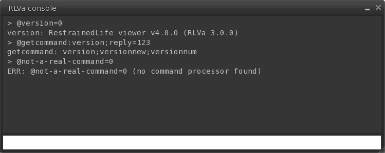

# Console

The console is a handy tool built right into RLVa that allows you to easily execute RLV commands without needing to write any scripts.

## How to Access the RLVa Console
To open the console, go to the RLVa menu and select 'Console...'.

## Executing Commands
Commands in the console are executed as if your avatar is the object issuing them. This means that commands affecting the issuer (e.g., `@detach=n`) will not work. Don't worry if this seems unclear at first.

You can set restrictions in the console (e.g., `@tploc=n`), and they will remain active as long as the console is open. In other words, all restrictions are cleared when you close the console.

Some RLV commands return a reply after execution. Normally, these replies are sent on a channel that only scripts can listen to. However, by using channel '0', you can have the reply displayed directly in the console (as shown in the screenshot).
